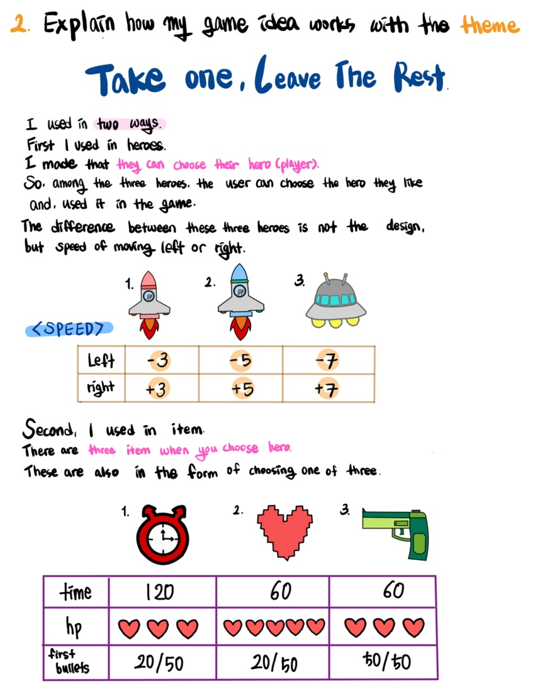
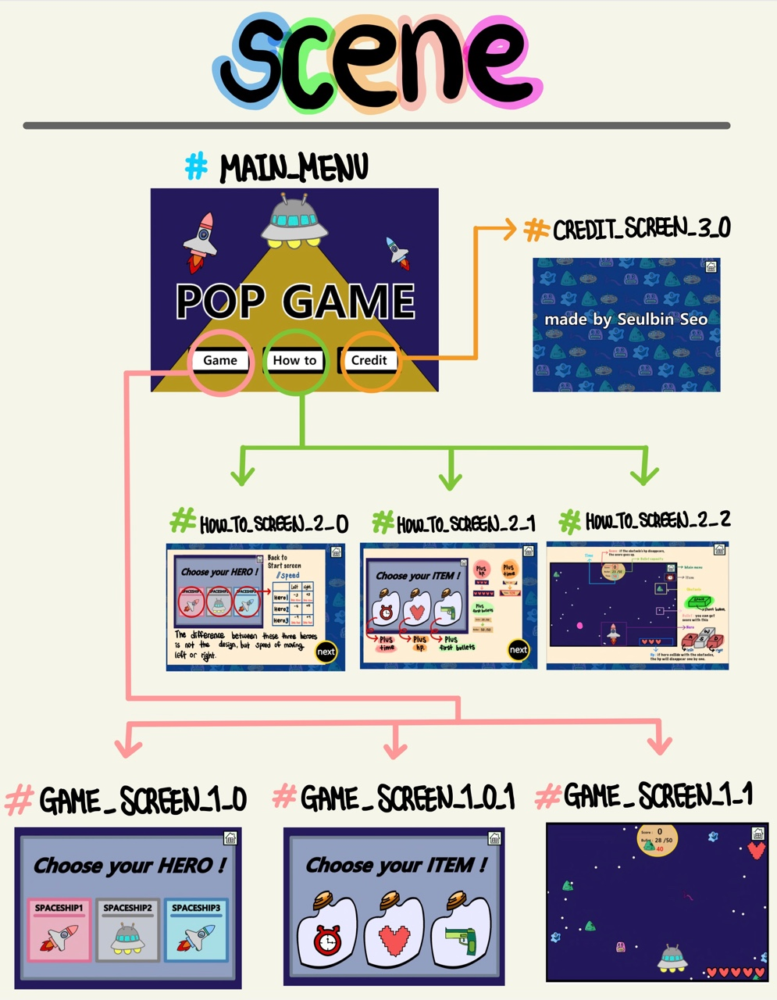
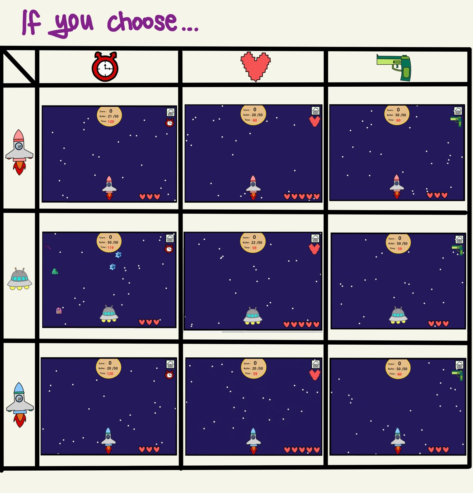

// Name       : Seulbin Seo       
// Assignment : final_project_make_a_game       
// Course     : CS099      
// Spring 2021      

Game Design Document
=====================
High Concept
--------------

# Game name 
    : POP GAME
# Game Genre
    : Third Person Shooter, TPS or 3PS
# Game Concept
    : Heroes travel in spacecraft and eat star-shaped bullets.          
    The concept is to save the universe by collecting the bullets and shooting obstacles.    
    Pick your own hero and items and use them to play the game.      

Theme
-------
# Game Theme 

# Game Scene

#Final 

br/>

